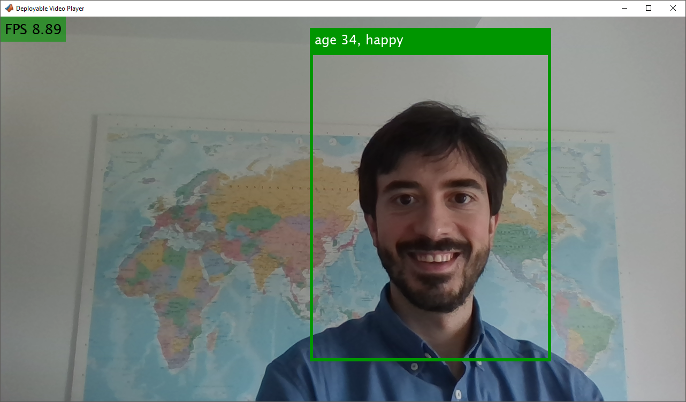

# FaceGenderAgeEmotionDetection 
Demo for face, gender, age and emotion detection (all using Deep Learning), together with some Computer Vision features to enhance detection and tracking.

Note all these networks have their origins in research. **Use preferably with a GPU.**

## Requirements:
### In MATLAB
* [Deep Learning Toolbox Importer for Caffe Models](https://www.mathworks.com/matlabcentral/fileexchange/61735-deep-learning-toolbox-importer-for-caffe-models)
* [MATLAB Support Package for USB Webcams](https://www.mathworks.com/matlabcentral/fileexchange/45182-matlab-support-package-for-usb-webcams)

### Deployed on a Jetson
* [Deep Learning Toolbox Importer for Caffe Models](https://www.mathworks.com/matlabcentral/fileexchange/61735-deep-learning-toolbox-importer-for-caffe-models)
* [MATLAB Support Package for USB Webcams](https://www.mathworks.com/matlabcentral/fileexchange/45182-matlab-support-package-for-usb-webcams)
* [GPU Coder Support Package for NVIDIA GPUs](https://mathworks.com/matlabcentral/fileexchange/68644-gpu-coder-support-package-for-nvidia-gpus)
* [GPU Coder Interface for Deep Learning Libraries](https://mathworks.com/matlabcentral/fileexchange/68642-gpu-coder-interface-for-deep-learning-libraries)

## Installation
This demo uses pre-trained models in Caffe (requires downloading ~1.16GB). 

Add folder to search path and check for Add-on requirements by running:
```matlab 
>> install
```

For downloading the models, run:
```matlab 
>> downloadAndSetupNetworks
```

## Usage
### In MATLAB
You may run face, age and emotion detection by running (gender detection is disabled by default):
```matlab
>> faceGenderAgeEmotionDetection
```


or choose which of the available models to use. For instance:
```matlab
>> faceGenderAgeEmotionDetection(true,true,true)
```
which runs gender, age and emotion detection. The demo uses binary gender detection, which may be consider inappropriate. Its use is not recommended in a public setting.

You may also speed up perfomance by generating MEX files using GPU Coder for each of the predict functions:
1. Make sure that your computer is setup correctly:
```matlab
>> coder.checkGpuInstall
```
2. Generate mex files:
```matlab
>> generateCode
```

### Deployed on a Jetson
1. Make sure that your environment is setup correctly:
```matlab
>> coder.checkGpuInstall('tx2');
```
2. Open the codegen script
```matlab
>> edit generateCodeForJetson
```
3. Modify it to reflect your current configuration (e.g. IP address).
4. Run the first section to generate CUDA code on the host, transfer it to the Jetson and compile it.
5. Run the second section to launch the executable on the jetson. Please note that you can change the clock speed to maximise the performance.

## References

[1] Abars, Face Search VGG16, (2018). GitHub repository, https://github.com/abars/FaceSearchVGG16
	
[2] Rasmus Rothe, Radu Timofte and Luc Van Gool, (2016). Deep expectation of real and apparent age from a single image without facial landmarks. International Journal of Computer Vision (IJCV)
	
[3] Jia, Yangqing, et al., (2014). "Caffe: Convolutional architecture for fast feature embedding." Proceedings of the 22nd ACM international conference on Multimedia. ACM.

[4] Gil Levi and Tal Hassner, (2015). Emotion Recognition in the Wild via Convolutional Neural Networks and Mapped Binary Patterns. Proc. ACM International Conference on Multimodal Interaction (ICMI).     https://osnathassner.github.io/talhassner/projects/cnn_emotions/project.html
